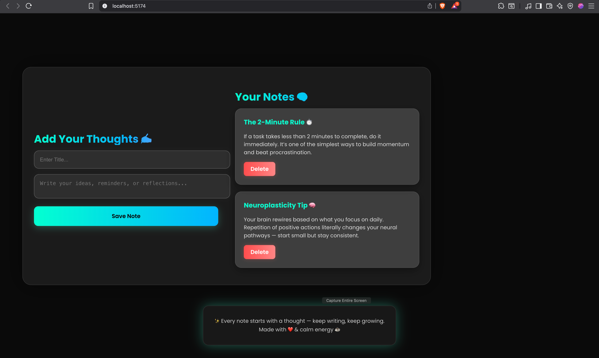

# 🧠 React Glass Notes App

A modern, glassmorphic notes app built with **React**, **TailwindCSS**, and **Framer Motion** ✨  
Beautifully animated with a calm productivity vibe — save, view, and delete your thoughts instantly.  

---

## 🚀 Features

- 🪞 **Glassmorphic Design** – clean, modern UI with floating glass effects  
- ⚡ **Framer Motion Animations** – smooth transitions & hover effects  
- 💾 **LocalStorage Support** – keeps your notes even after page reload  
- 🎨 **Dark Mode Vibe** – aesthetic gradient background & soft shadows  
- 🧩 **Fully Responsive** – works perfectly on MacBook, iPad, or mobile  

---

## 📸 Preview



> _“Every note starts with a thought — keep writing, keep growing.”_ 🌿

---

## 🧰 Tech Stack

- React.js ⚛️  
- TailwindCSS 💨  
- Framer Motion 🎞️  
- LocalStorage API  

---

## ⚙️ Setup Instructions

### Clone this repository
```bash
git clone https://github.com/Dhruv-hub26/react-glass-notes-app.git
cd react-glass-notes-app

📁 Folder Structure
react-glass-notes-app/
 ├── public/
 ├── src/
 │   ├── App.jsx
 │   ├── App.css
 │   ├── main.jsx
 │   └── assets/
 ├── package.json
 ├── tailwind.config.js
 └── README.md

🧠 Inspiration

This project was inspired by modern minimalist design trends & calm productivity tools.
A great mini-project to learn React state management, animations, and clean UI building.

🧑‍💻 Author

Dhruv Mehra
💼 GitHub